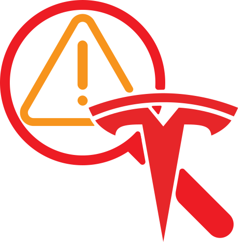

[![Contributors][contributors-shield]][contributors-url]
[![Forks][forks-shield]][forks-url]
[![Stargazers][stars-shield]][stars-url]
[![Issues][issues-shield]][issues-url]
[![MIT License][license-shield]][license-url]
[![View Website][website-shield]][website-url]

<!-- PROJECT LOGO -->
<br />
<p align="center">
  <a href="https://github.com/core-hacked/">
    
  </a>

  <h3 align="center">Tesla Alerts Dictionary</h3>

  <p align="center">
    This repository aims to provide a dictionary of Tesla alerts and their meanings including an option to search for them.
    <br />
    <a href="tesla-alerts-dictionary.corehacked.codes">View Website</a>
    ·
    <a href="https://github.com/core-hacked/tesla-alerts-dictionary/issues">Report Issue</a>
    ·
    <a href="https://github.com/core-hacked/tesla-alerts-dictionary/pulls">Contribute</a>
  </p>
</p>

<!-- TABLE OF CONTENTS -->
<details open="open">
  <summary><h2 style="display: inline-block">Table of Contents</h2></summary>
  <ol>
    <li>
      <a href="#about-the-project">About The Project</a>
      <ul>
        <li><a href="#built-with">Built With</a></li>
      </ul>
    </li>
    <li>
      <a href="#getting-started">Getting Started</a>
      <ul>
        <li><a href="#prerequisites">Prerequisites</a></li>
        <li><a href="#installation">Installation</a></li>
      </ul>
    </li>
    <li><a href="#usage">Usage</a></li>
    <li><a href="#roadmap">Roadmap</a></li>
    <li><a href="#contributing">Contributing</a></li>
    <li><a href="#license">License</a></li>
    <li><a href="#contact">Contact</a></li>
  </ol>
</details>

<!-- ABOUT THE PROJECT -->

## About The Project

### Built With

- [HTML5](https://github.com/whatwg/html)
- [JavaScript](https://github.com/tc39)
- [Flowbite](https://flowbite.com/)
- [Webpack](https://webpack.js.org/)

<!-- GETTING STARTED -->

## Getting Started

To get a local copy up and running follow these simple steps.

### Prerequisites

You can deploy the server however you want, this is just an example of how you can do it.

- Apache (for debian-based systems / using apt)
  ```sh
  sudo apt install apache2
  ```
- Apache (for arch-based systems / using pacman)
  ```sh
  pacman -S apache
  ```

### Installation

1. Clone the repo
   ```sh
   git clone https://github.com/core-hacked/tesla-alerts-dictionary.git
   ```
2. Start an Apache server to run the repo
   ```sh
   /etc/init.d/apache2 start
   ```
   Or on Debian 8.x+ based systems | Or on Ubuntu 15.04+
   ```sh
   systemctl start apache2.service
   ```
3. Copy the repo to the Apache server
   ```sh
   cp -r tesla-alerts-dictionary/ /var/www/html/
   ```

````
4. Open the website in your browser
 ```sh
 http://localhost/tesla-alerts-dictionary/
````

### If you make changes to the code, be sure to run the following commands, to ensure that it actually updates.

<br>

1. Install the dependencies
   ```sh
    npm install
   ```
2. Build the project. The JavaScript file will be generated in the `dist` folder.
   ```sh
    npm run build
   ```
3. Configure / run TailwindCSS to generate the CSS file. The CSS file will be generated in the `dist` folder. It will also watch for changes to the `src` folder and inside the HTML and automatically update the `output.css` file in `/dist/`.
   ```sh
    npx tailwindcss -i ./src/input.css -o ./dist/output.css --watch
   ```
4. If you update the alerts dictionary/files inside the `/alerts/` folder, be sure to run the `maker.py` script to automatically generate the buttons for the alerts. Then just copy them into `index.html`. If needed reference the `index.html` file in the `/src/` folder. The buttons will be generated into the `alerts_index.html` file.
   ```sh
   cd tools/
   python3 maker.py
   ```
5. When contributing, be sure to run [prettier](https://prettier.io/) to format the code. You may ignore the alert buttons as they take a lot of time to format. Don't forget to delete the `alerts_index.html` file after you're done.

<!-- ROADMAP -->

## Roadmap

See the [open issues](https://github.com/core-hacked/tesla-alerts-dictionary/issues) for a list of proposed features (and known issues).

### Todo:

- [ ] Document alerts, fix typos, and add more infomation.
- [ ] Fix the header/button overlap when a successful search is made.
- [ ] Possibly add a button to copy the alert code to the clipboard.
- [ ] Make the buttons in the alert popup more mobile friendly/less cramped.
- [ ] Autofocus/search when <kbd>CTRL</kbd> + <kbd>F</kbd> is pressed.
- [ ] Make the search system not depend on buttons inside the dom, but rather a json file.
- [ ] Let js generate the buttons from the json file, instead of having to manually copy them into the html file.
- [ ] Sync the creation process to GitHub Actions on PRs.
- [ ] Streamline the deployment process, and make it a one-click deploy.

<!-- CONTRIBUTING -->

## Contributing

Contributions are what make the open source community such an amazing place to be... learn, inspire, and create. Any contributions you make are **greatly appreciated**.

1. Fork the Project
2. Create your Feature Branch (`git checkout -b feature/AmazingFeature`)
3. Commit your Changes (`git commit -m 'Add some AmazingFeature'`)
4. Push to the Branch (`git push origin feature/AmazingFeature`)
5. Open a Pull Request

<!-- LICENSE -->

## License

Distributed under the GNU GPL v3 License. See `LICENSE` for more information.

<!-- CONTACT -->

## Contact

[info@corehacked.codes](mailto:info@corehacked.codes)

<!-- MARKDOWN LINKS & IMAGES -->
<!-- https://www.markdownguide.org/basic-syntax/#reference-style-links -->

[contributors-shield]: https://img.shields.io/github/contributors/core-hacked/tesla-alerts-dictionary.svg?colorA=1e1e28&colorB=E38C8F&style=for-the-badge&logo=starship%20style=for-the-badge
[contributors-url]: https://github.com/core-hacked/tesla-alerts-dictionary/graphs/contributors
[forks-shield]: https://img.shields.io/github/forks/core-hacked/tesla-alerts-dictionary.svg?colorA=1e1e28&colorB=A4B9EF&style=for-the-badge&logo=starship%20style=for-the-badge
[forks-url]: https://github.com/core-hacked/tesla-alerts-dictionary/network/members
[stars-shield]: https://img.shields.io/github/stars/core-hacked/tesla-alerts-dictionary.svg?colorA=1e1e28&colorB=EBDDAA&style=for-the-badge&logo=starship%20style=for-the-badge
[stars-url]: https://github.com/core-hacked/tesla-alerts-dictionary/stargazers
[issues-shield]: https://img.shields.io/github/issues/core-hacked/tesla-alerts-dictionary.svg?colorA=1e1e28&colorB=B1E3AD&style=for-the-badge&logo=starship%20style=for-the-badge
[issues-url]: https://github.com/core-hacked/tesla-alerts-dictionary/issues
[license-shield]: https://img.shields.io/github/license/core-hacked/tesla-alerts-dictionary.svg?colorA=1e1e28&colorB=F9C096&style=for-the-badge&logo=starship%20style=for-the-badge
[license-url]: https://github.com/core-hacked/tesla-alerts-dictionary/blob/master/LICENSE.txt
[website-shield]: https://img.shields.io/badge/Website-View%20Deployment-blue?colorA=1e1e28&colorB=A4B9EF&style=for-the-badge&logo=starship%20style=for-the-badge
[website-url]: tesla-alerts-dictionary.corehacked.codes
